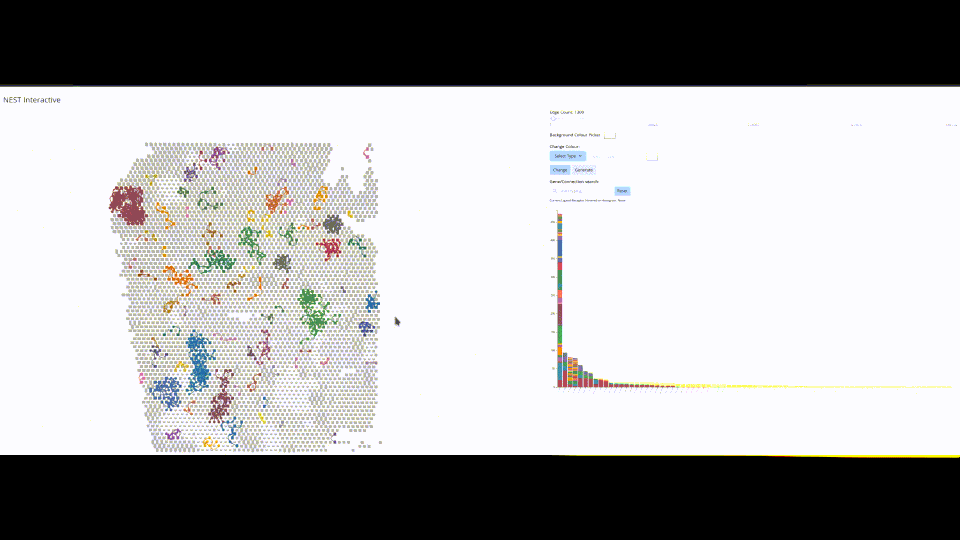
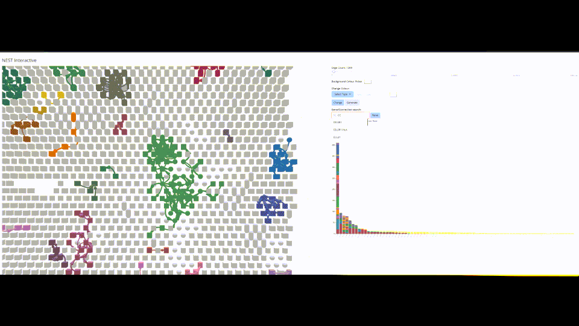
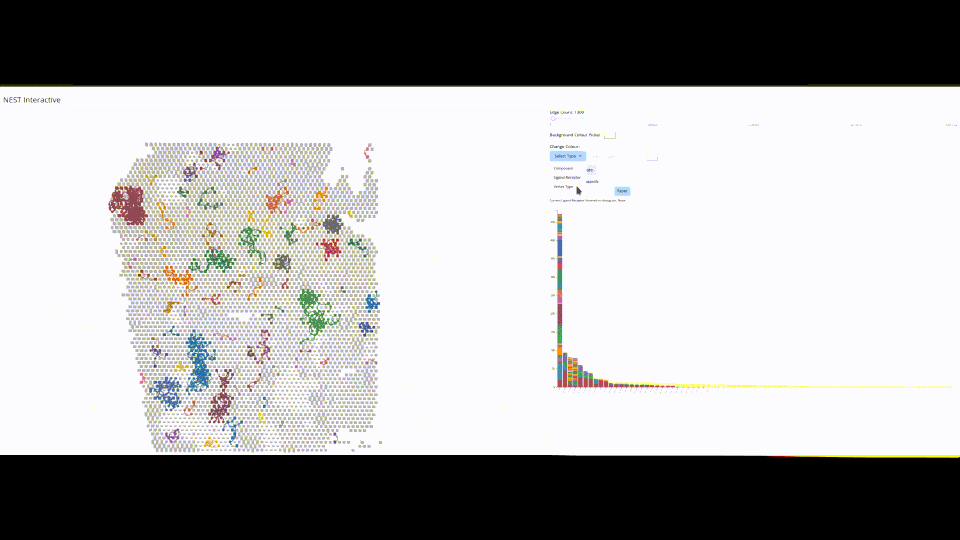
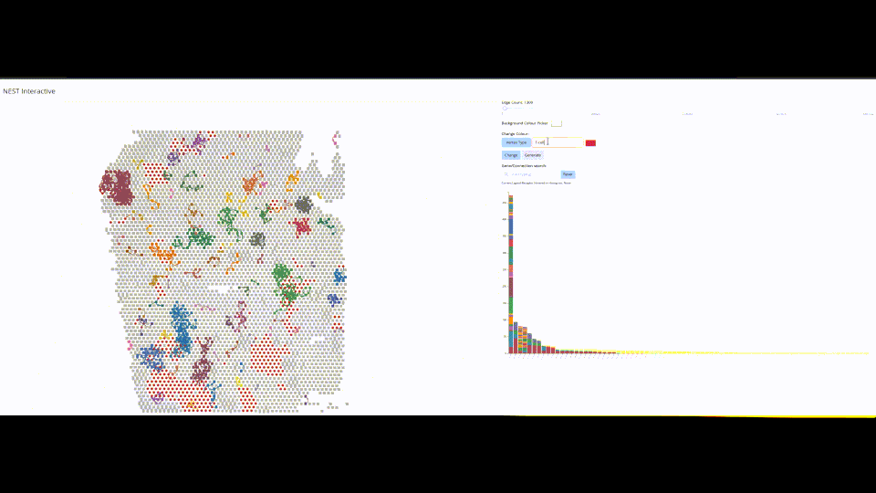
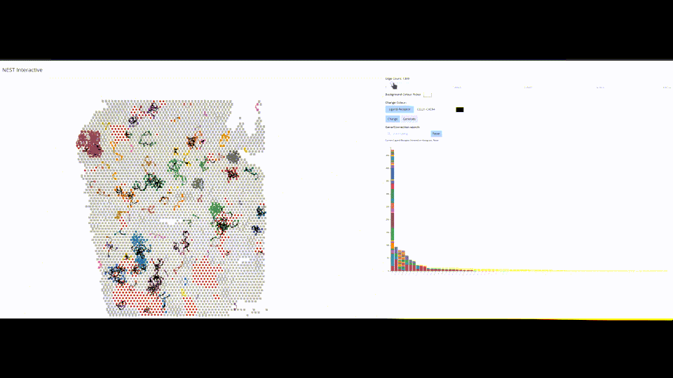

#  CellNEST 

Preprint: [NEST: Spatially-mapped cell-cell communication patterns using a deep learning-based attention mechanism](https://www.biorxiv.org/content/10.1101/2024.03.19.585796v1)

### Singularity Image:

For users' convenience, we have a singularity image with the full installation of the environment for running the CellNEST model. Users can pull the image using the following command:
```
singularity pull cellnest_image.sif library://fatema/collection/nest_image.sif:latest
```
No additional installation of any package is required with this image. A vignette for following this approach is provided [here](vignette/running_NEST_singularity_container.md). This is tested on Digital Alliance as well. For the users who want to install the environment themselves, we provide the list of required Python packages and supported systems below.  

###   Used Python packages: 
[Python libraries](https://github.com/schwartzlab-methods/CellNEST/blob/main/requirements.txt)

###   System requirements: 
This model is developed on CentOS 7 and GPU servers with versions: Nvidia P100 and V100. This model is expected to run on any Linux server with GPU nodes, e.g., Digital Alliance (already tested) as well. A brief installation script of Python packages for Digital Alliance is provided [here](install_on_digital_alliance_readme.md). Installation time on a typical HPC should take less than 5 minutes (for 1 Intel Xeon CPU @ 2 GHz and 8 GB memory, installation takes 3 minutes). 
  
### Setup the system to recognize 'cellnest' command to run the model:

Download the CellNEST repository at your desired location and change your current working directory to CellNEST. Run the following bash script: 
````
sudo bash setup.sh
````
This is to be executed once only when CellNEST is run for the first time. This setup makes the bash script 'cellnest' executable and copies it to your '$HOME/.local/bin/' so that your system can recognize 'cellnest' command. However, if you are running the model in a remote server where you don't have permission to make such changes, you can skip this step and let the 'cellnest' command be preceded by the 'bash' command for all the instructions provided below. 

## Instruction to run CellNEST:

We use publicly available Visium sample on human lymph node (https://www.10xgenomics.com/datasets/human-lymph-node-1-standard-1-1-0) for the demonstration purpose. Please download the following two files:

a. The filtered feature matrix from here: https://cf.10xgenomics.com/samples/spatial-exp/1.1.0/V1_Human_Lymph_Node/V1_Human_Lymph_Node_filtered_feature_bc_matrix.h5

b. The spatial imaging data from here: https://cf.10xgenomics.com/samples/spatial-exp/1.1.0/V1_Human_Lymph_Node/V1_Human_Lymph_Node_spatial.tar.gz (please unzip the spatial imaging data)

Both should be kept under the same directory, e.g., data/V1_Human_Lymph_Node_spatial/ directory. We have provided a default ligand-receptor database by merging the records from CellChat and NicheNet database. This is kept under 'database/' directory and will be used by CellNEST unless some other database is referred by the user.   

Change your current working directory to the downloaded CellNEST repository. Then execute following commands to run CellNEST on the human lymph node sample. 
   
1. CellNEST takes two main inputs: spatial transcriptomics dataset and a ligand-receptor database. Assuming that the spatial dataset is in "data/V1_Human_Lymph_Node_spatial/" directory and the ligand-receptor database is in 'database/NEST_database.csv', data preprocessing for input graph generation can be done as follows:
````
cellnest preprocess --data_name='V1_Human_Lymph_Node_spatial' --data_from='data/V1_Human_Lymph_Node_spatial/'
````
It will create two folders in the current working directories: "input_graph/V1_Human_Lymph_Node_spatial/" and "metadata/V1_Human_Lymph_Node_spatial/" to save the preprocessed input data. Additionally, if you want to integrate intracellular pathway with ligand-receptor coexpression, please use following command with additional parameter: --add_intra=1
```
cellnest preprocess_intra --data_name='V1_Human_Lymph_Node_spatial' --data_from='data/V1_Human_Lymph_Node_spatial/' --add_intra=1
```

Please use the argument --help to see all available input parameters.  

2. To train a CellNEST model on the preprocessed 'V1_Human_Lymph_Node_spatial' data use following command with preferred model name. If the same experiment if repeated multiple times for model ensemble, each time a different run_id should be used and the run_id is expected to be consecutive. For example, if it is run five times then the run_id for the five runs should be 1, 2, 3, 4, and 5 respectively. By default the model will be trained for 80,000 epochs. Please use the argument --help to see all available input parameters. Please note that, the script will use GPU if avaiable, otherwise it will use CPU. Since this is a time consuming step, we suggest to run this step in the background and print the outputs in a separate log file as follows:

````
nohup cellnest run --data_name='V1_Human_Lymph_Node_spatial' --num_epoch 80000 --model_name='CellNEST_V1_Human_Lymph_Node_spatial' --run_id=1 > output_human_lymph_node_run1.log &
nohup cellnest run  --data_name='V1_Human_Lymph_Node_spatial' --num_epoch 80000 --model_name='CellNEST_V1_Human_Lymph_Node_spatial' --run_id=2 > output_human_lymph_node_run2.log &
nohup cellnest run  --data_name='V1_Human_Lymph_Node_spatial' --num_epoch 80000 --model_name='CellNEST_V1_Human_Lymph_Node_spatial' --run_id=3 > output_human_lymph_node_run3.log &
nohup cellnest run  --data_name='V1_Human_Lymph_Node_spatial' --num_epoch 80000 --model_name='CellNEST_V1_Human_Lymph_Node_spatial' --run_id=4 > output_human_lymph_node_run4.log &
nohup cellnest run  --data_name='V1_Human_Lymph_Node_spatial' --num_epoch 80000 --model_name='CellNEST_V1_Human_Lymph_Node_spatial' --run_id=5 > output_human_lymph_node_run5.log &
````

  It will save trained model state with minimum loss in 'model/V1_Human_Lymph_Node_spatial/' and the corresponding attention scores and node embedding in 'embedding_data/V1_Human_Lymph_Node_spatial/'.   

3. To postprocess the model output, i.e., ensemble of multiple runs (through rank of product) and producing list of top 20% highly ranked communications we have to run following commands:

````
cellnest postprocess --data_name='V1_Human_Lymph_Node_spatial' --model_name='CellNEST_V1_Human_Lymph_Node_spatial' --total_runs=5 
````

  In the command, we use --total_runs=5 assuming that the model is run five times. The top 20% highly ranked communications are saved in a file named as 'V1_Human_Lymph_Node_spatial_top20percent.csv' in "output/V1_Human_Lymph_Node_spatial/".  

4. To visualize the output graph, i.e., finding connected components and ploting them, we run following command:

````
cellnest visualize --data_name='V1_Human_Lymph_Node_spatial' --model_name='CellNEST_V1_Human_Lymph_Node_spatial'
````

This step generates [six files](https://github.com/schwartzlab-methods/CellNEST/blob/main/vignette/user_guide.md#output) under the directory 'output/V1_Human_Lymph_Node_spatial/' inlcluding a NetworkX plot for visualizing the CCC. 
 
Although the NetworkX plot shows the appealing view of CCC, it can be very big and memory-consuming to open in the web-browser and inconvenient to share. Therefore we prefer to convert the corresponding *.dot file to a *.pdf and *.svg file by executing the following command (takes input the path of *.dot file as an argument): 

```
cellnest output_graph_picture output/V1_Human_Lymph_Node_spatial/CellNEST_V1_Human_Lymph_Node_spatial_test_interactive.dot
```
It will generate two files: edge_graph.svg and edge_graph.pdf in the current working directory, which are easy to view and share. 

CellNEST also supports plotting downstream TF genes for a receptor gene, such as "CCR7" for the lymph node sample using the following command:
```
cellnest downstream --adata_path='data/V1_Human_Lymph_Node_spatial/V1_Human_Lymph_Node_filtered_feature_bc_matrix' --positions_path='data/V1_Human_Lymph_Node_spatial/spatial/tissue_positions_list.csv' --gene='CCR7' 
```
This will plot the downstream average gene expression of the top 20% TF of 'CCR7' and save the result at "output/downstreamGene_CCR7.html" 


Additionally, the following three commands will output the relay patterns, cell type identification for those, and associated confidence score:

```
cellnest relay_extract --data_name='V1_Human_Lymph_Node_spatial' --metadata='metadata/' --top_ccc_file='output/V1_Human_Lymph_Node_spatial/V1_Human_Lymph_Node_spatial_ccc_list_top3000.csv' --output_path='relay_validation_sample_data/lymph_node/'
```

```
cellnest relay_celltype --input_path='relay_validation_sample_data/lymph_node/' --output_path='CellNEST_figures_output/' --annotation_file='relay_validation_sample_data/lymph_node/fractional_abundances_by_spot.csv' --modality='spot'

```

```
cellnest relay_confidence --input_path='relay_validation_sample_data/lymph_node/' --output_path='CellNEST_figures_output/' --organism='human' --database_dir='database/'
```


### CellNEST Interactive
Finally, you can interactively visualize the cell-cell communication on tissue surface by using CellNEST Interactive: a web-based data visualization tool. The detailed instructions for running the interactive tool are provided here: https://github.com/schwartzlab-methods/cellnest-interactive

If the platform you are using to run the CellNEST model also supports web-based data visualization, you can use the same cellnest command to start the interactive interface. We will need to pass the directory path containing the CellNEST interactive repository and the port number to start the frontend of the web-based interface. The following files (from metadata/ and output/) are also to be put in a directory and passed to the interactive interface. 

1. cell_barcode_*.csv file generated by CellNEST in the data preprocessing step (can be found from metadata/). 
2. coordinates_*.csv file generated by CellNEST in the data preprocessing step (can be found from metadata/).
3. *_self_loop_record.gz file generated by CellNEST in the data preprocessing step (can be found from metadata/).
4. Optional *_annotation.csv file, if available (can be found from metadata/).
5. CellNEST_*_top20percent.csv file generated by CellNEST in the data postprocessing step (can be found from output/).
 
For example, if the interactive repository is kept under the current working directory, port number 8080 is used, and the above-mentioned five files are kept at this path "cellnest-interactive-main/server/data/files/", then the following command should open the CellNEST interactive interface using default web-browser:
```
cellnest interactive cellnest-interactive-main/ 8080 cellnest-interactive-main/server/data/files/
```
#### Zoom and pan exploration


#### Ligand-Receptor pair filtering


#### Vertex (spot or cell) color changing


#### Communication color changing


#### Increase range of reliable signals


## [User Guide](vignette/user_guide.md)

## Dataset
1. Human Lymph Node: https://www.10xgenomics.com/datasets/human-lymph-node-1-standard-1-0-0
2. Mouse Hypothalamic Preoptic region: https://datadryad.org/stash/dataset/doi:10.5061/dryad.8t8s248}
3. Lung Cancer Adenocarcinoma (LUAD): The Gene Expression Omnibus under accession number GSE189487.
4. Pancreatic Ductal Adenocarcinoma (PDAC): The Gene Expression Omnibus accession number is to be provided before publication.

## Vignette
For a detailed explanation of the available parameters and their usage, please see the vignettes:

1. [Main workflow: Generate active CCC lists given a spatial transcriptomics data](vignette/workflow.md)
2. [Downstream analysis to filter CCC list for specific region / cell type / specific ligand-receptor pair](vignette/filter_ccc_list_for_type_region.md)
3. [Running the CellNEST model through singularity image](vignette/running_NEST_singularity_container.md) 
4. [CellNEST on deconvoluted Spatial Transcriptomics data](vignette/deconvolute_ST.md) 
5. [CellNEST on MERFISH data after gene imputation using scRNA-seq data](vignette/integrate_scRNAseq_merfish.md) 

   
    
