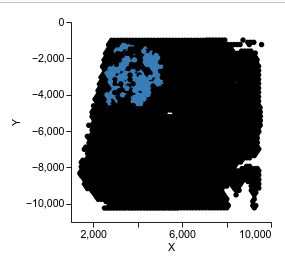
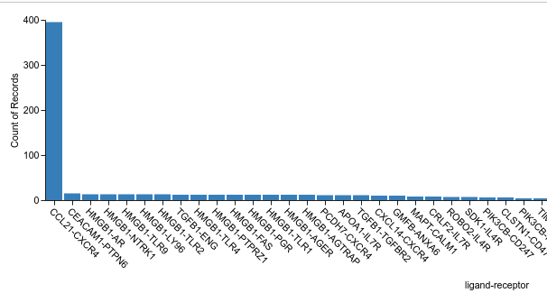
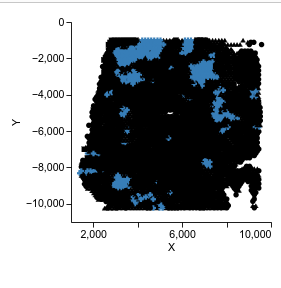
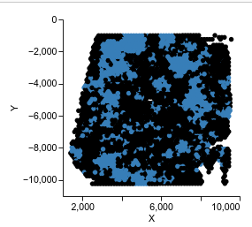

This workflow will demonstrate how to filter predicted CCC based on cell type, component/region, and ligand-receptor pair. We will start with the visualization without any particular filter and then we will show how each filter works, step by step. 


````
nest visualize --data_name='V1_Human_Lymph_Node_spatial' --model_name 'NEST_V1_Human_Lymph_Node_spatial' --top_edge_count=3000
````


## Filter by component/region
````
nest visualize --data_name='V1_Human_Lymph_Node_spatial' --model_name 'NEST_V1_Human_Lymph_Node_spatial' --top_edge_count=3000 --filter=1 --filter_by_component=7
````




## Filter by annotation
````
nest visualize --data_name='V1_Human_Lymph_Node_spatial' --model_name='NEST_V1_Human_Lymph_Node_spatial' --top_edge_count=400000 --filter=1 --filter_by_annotation='T-cell' --annotation_file_path=data/V1_Human_Lymph_Node_spatial_annotation.csv 
````



## Filter by ligand-receptor pair

```
nest visualize --data_name='V1_Human_Lymph_Node_spatial' --model_name='NEST_V1_Human_Lymph_Node_spatial' --top_edge_count=400000 --filter=1 --filter_by_ligand_receptor='CCL19-CCR7'
```



